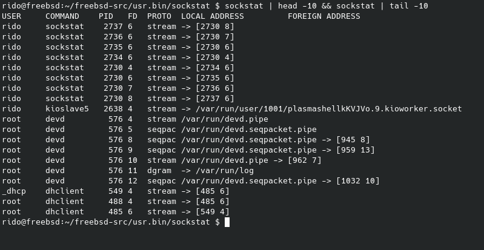
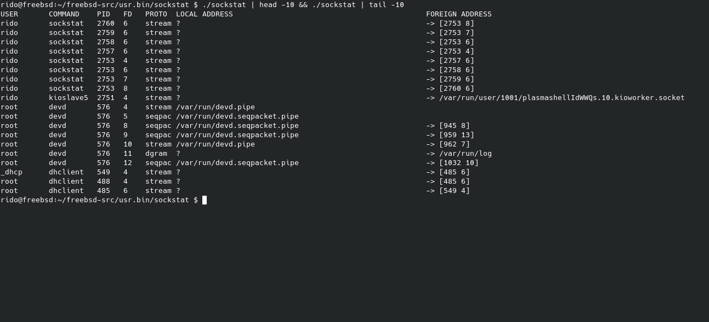

# 🛠️ Sockstat UI Improvements – GSoC 2025  

## Overview  
This project is a part of **Google Summer of Code (GSoC) 2025** and aims to improve the **sockstat** utility in FreeBSD by introducing **automatically sized columns** for better readability.  

Previously, column widths were fixed or inconsistent, making it difficult to read long entries. With this update, **sockstat now dynamically adjusts column widths** based on the longest entry in each field, ensuring a clean and structured output.  

---

## Before & After Comparison  

### Before (Fixed Column Widths)  
*(Difficult to read when entries are long or misaligned.)*  
  

### After (Dynamically Adjusted Columns)  
*(Now columns expand automatically to fit content.)*  
  

---

## How It Works  
The new implementation follows a **two-pass approach**:  

1. **First Pass – Calculate Maximum Widths:**  
   - Iterate through all socket entries and determine the **longest string length** for each column.  
   - Store these maximum widths in a structure.  

2. **Second Pass – Print with Dynamic Formatting:**  
   - Use the precomputed widths to format the output.  
   - Utilize `%-*s` formatting in `printf()` (or `xo_emit()` for libxo integration).  
   - Ensures **proper alignment** without unnecessary padding or truncation.  

---

## How to Test the New Sockstat Version  

Follow these steps to download and test the improved version of **sockstat**:  

```
pkg install curl
curl -O https://raw.githubusercontent.com/daminrido139/freebsd-src/main/usr.bin/sockstat/sockstat
chmod +x sockstat
./sockstat
```

## Future Improvements
- Integrate libxo for structured output in JSON/XML/HTML formats.
- Further optimize column width calculation for better efficiency.
